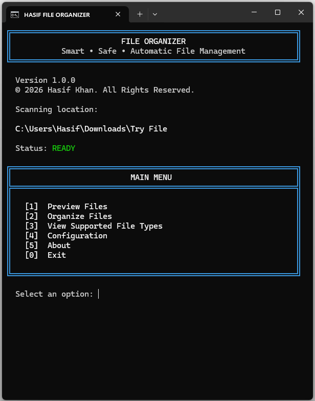
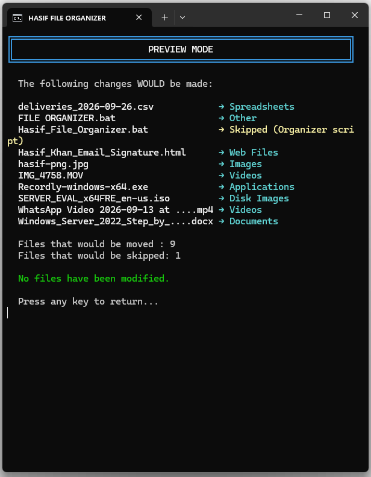
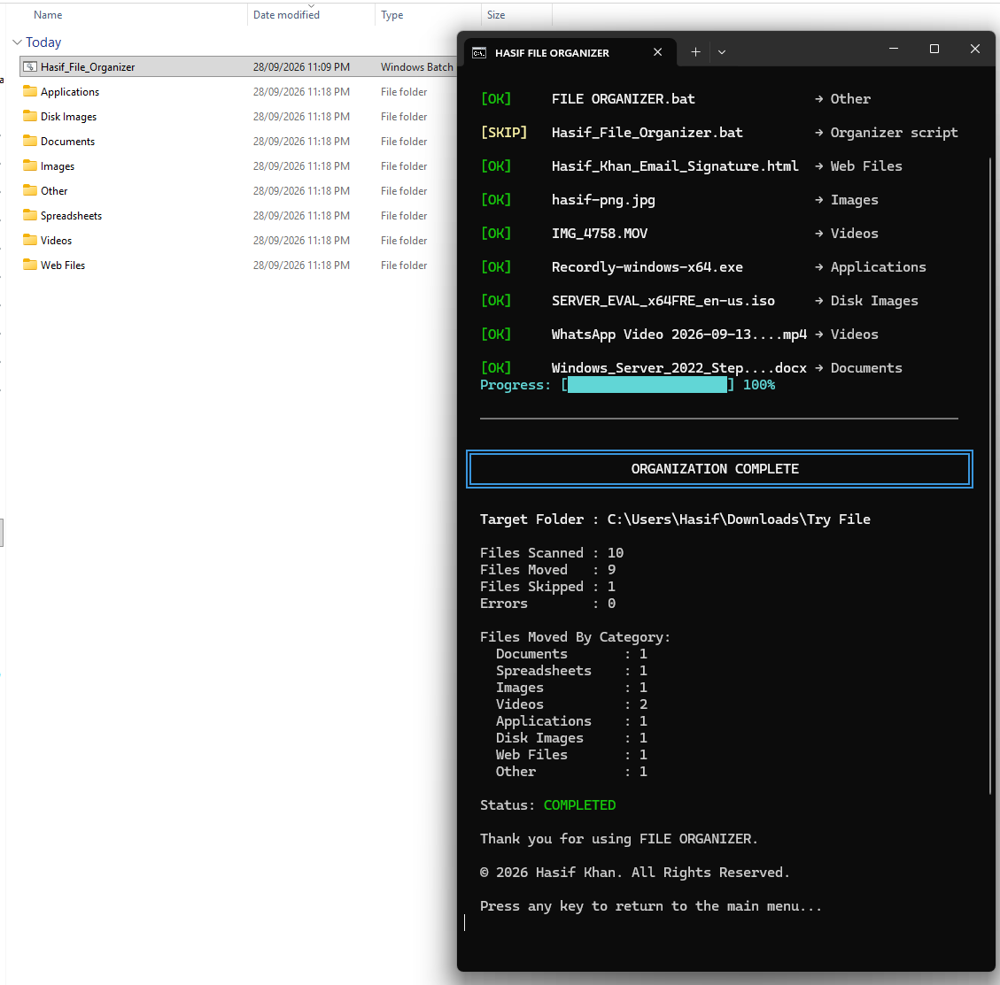

# HASIF FILE ORGANIZER

<p align="center">
  <strong>Smart • Safe • Automatic File Management</strong>
</p>

<p align="center">
  A lightweight Windows utility that automatically organizes files into category-based folders.
</p>

<p align="center">


</p>

---

## 🖥️ Overview

**HASIF FILE ORGANIZER** is a Windows-based file management utility designed to automatically organize files according to their file extensions.

Instead of manually sorting documents, images, videos, music, archives, applications, and other files, simply place the organizer inside a folder and let it categorize the files automatically.

The application is designed with a simple interactive console interface, Preview Mode, duplicate-file protection, and safe file movement.

---

## ✨ Features

* 📁 Automatic file categorization
* 🔍 Preview / Dry Run mode
* 🛡️ Duplicate filename protection
* 🚫 No file deletion
* 🔒 No internet connection required
* ⚡ Fast local file organization
* 📂 Existing subfolders are not scanned
* 🪟 Windows 10 / Windows 11 support
* 💻 Single BAT-file distribution
* ⚙️ PowerShell-assisted file operations
* 🎨 Clean console interface
* ©️ Built-in copyright information

---

## 🖥️ Application Interface

The application starts with a simple interactive menu where you can preview files, organize them, view supported file types, or access information about the application.

<p align="center">
  
</p>

---

## 🔍 Preview Before Organizing

Before moving any files, you can use **Preview Files** to see how the organizer will categorize your files.

Preview mode does **not** modify or move anything.

<p align="center">
  
</p>

---

## 📂 Automatic Organization

After reviewing the preview, select **Organize Files** and confirm the operation.

The organizer automatically creates the required category folders and moves the corresponding files.

<p align="center">
  
</p>

---

## 📦 Example

### Before

```text
Downloads/
│
├── report.docx
├── budget.xlsx
├── photo.jpg
├── movie.mp4
├── song.mp3
├── archive.zip
├── Windows.iso
└── Hasif_File_Organizer.bat
```

### After

```text
Downloads/
│
├── Documents/
│   └── report.docx
│
├── Spreadsheets/
│   └── budget.xlsx
│
├── Images/
│   └── photo.jpg
│
├── Videos/
│   └── movie.mp4
│
├── Music/
│   └── song.mp3
│
├── Archives/
│   └── archive.zip
│
├── Disk Images/
│   └── Windows.iso
│
└── Hasif_File_Organizer.bat
```

---

## 🗂️ Supported File Categories

| Category          | Common Extensions                                                                          |
| ----------------- | ------------------------------------------------------------------------------------------ |
| 📄 Documents      | `.doc`, `.docx`, `.odt`, `.rtf`                                                            |
| 📊 Spreadsheets   | `.xls`, `.xlsx`, `.xlsm`, `.csv`, `.ods`                                                   |
| 📽️ Presentations | `.ppt`, `.pptx`, `.pps`, `.ppsx`, `.odp`                                                   |
| 📕 PDFs           | `.pdf`                                                                                     |
| 📝 Text           | `.txt`, `.log`, `.md`, `.ini`, `.cfg`                                                      |
| 🖼️ Images        | `.jpg`, `.jpeg`, `.png`, `.gif`, `.bmp`, `.webp`, `.svg`, `.tif`, `.tiff`, `.ico`, `.heic` |
| 🎬 Videos         | `.mp4`, `.mkv`, `.avi`, `.mov`, `.wmv`, `.flv`, `.webm`, `.m4v`, `.3gp`                    |
| 🎵 Music          | `.mp3`, `.wav`, `.flac`, `.aac`, `.m4a`, `.ogg`, `.wma`                                    |
| ⚙️ Applications   | `.exe`, `.msi`, `.appx`, `.msix`                                                           |
| 💿 Disk Images    | `.iso`, `.img`, `.vhd`, `.vhdx`                                                            |
| 📦 Archives       | `.zip`, `.rar`, `.7z`, `.tar`, `.gz`, `.bz2`                                               |
| 🔗 Shortcuts      | `.lnk`, `.url`                                                                             |
| 🔤 Fonts          | `.ttf`, `.otf`, `.woff`, `.woff2`                                                          |
| 🎞️ Subtitles     | `.srt`, `.ass`, `.ssa`, `.vtt`                                                             |
| 🌐 Web Files      | `.html`, `.htm`, `.css`, `.js`, `.json`, `.xml`                                            |
| 📁 Other          | Unsupported extensions                                                                     |

---

## 🛡️ Safety

HASIF FILE ORGANIZER is designed to minimize accidental file changes.

### The application:

* Does **not** delete files.
* Does **not** overwrite existing destination files.
* Automatically handles duplicate filenames.
* Does **not** execute `.exe` files.
* Does **not** upload files anywhere.
* Does **not** require an internet connection.
* Does **not** scan inside existing subfolders.
* Provides a Preview Mode before making changes.

For important folders, it is recommended to run **Preview Files** first.

---

## ⚙️ How It Works

The application determines the folder where the BAT file is located and scans only the files directly inside that folder.

The file extension is then mapped to a category.

For example:

```text
report.docx  → Documents
photo.jpg    → Images
movie.mp4    → Videos
song.mp3     → Music
archive.zip  → Archives
program.exe  → Applications
Windows.iso  → Disk Images
```

The required category folder is created automatically if it does not already exist.

---

## 🚀 Usage

### 1. Download

Download or clone this repository.

### 2. Place the Organizer

Copy:

```text
Hasif_File_Organizer.bat
```

into the folder you want to organize.

### 3. Run

Double-click:

```text
Hasif_File_Organizer.bat
```

### 4. Preview

Select:

```text
[1] Preview Files
```

Review the proposed organization.

### 5. Organize

If everything looks correct, select:

```text
[2] Organize Files
```

and confirm:

```text
Continue? [Y/N]: Y
```

---

## 💻 Requirements

* Windows 10 or Windows 11
* Command Prompt
* Windows PowerShell

No Python installation is required.

No third-party software is required.

---

## 🔧 Customization

File-extension mappings can be customized inside the BAT file.

For example, to categorize EPUB files as Documents:

```powershell
'.epub'='Documents'
```

Additional categories and extensions can be added according to your requirements.

---

## 📁 Project Structure

```text
hasif-file-organizer/
│
├── Hasif_File_Organizer.bat
├── README.md
├── LICENSE
├── CONTRIBUTING.md
├── SECURITY.md
├── .gitignore
│
└── assets/
    └── screenshots/
        ├── main-menu.png
        ├── preview-mode.png
        └── organization-complete.png
```

---

## 🔐 Privacy

HASIF FILE ORGANIZER is designed as a local utility.

It does not upload your files, require an online account, or communicate with a remote server.

All organization operations occur locally on your Windows computer.

---

## 📌 Project Status

**Version:** `1.1.0`

**Status:** Stable

**Platform:** Windows

---

## 🛠️ Future Improvements

Potential future improvements include:

* Custom category configuration
* User-defined extension mapping
* Undo / restore functionality
* Advanced logging
* Configurable destination folders
* Additional file categories
* Optional graphical interface
* Portable executable distribution

---

## 🤝 Contributing

Contributions, suggestions, and improvements are welcome.

Please read [`CONTRIBUTING.md`](CONTRIBUTING.md) before submitting a pull request.

---

## 🔒 Security

For security-related concerns, please see [`SECURITY.md`](SECURITY.md).

---

## 📄 License

This project is licensed under the **MIT License**.

See [`LICENSE`](LICENSE) for the complete license text.

---

## 👨‍💻 Author

**Hasif Khan**

IT Infrastructure & Support • Networking • Cybersecurity • Automation

---

<p align="center">

<strong>HASIF FILE ORGANIZER</strong>

<br>

Smart • Safe • Automatic File Management

<br><br>

Copyright © 2026 Hasif Khan. All Rights Reserved.

</p>
